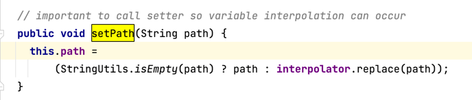
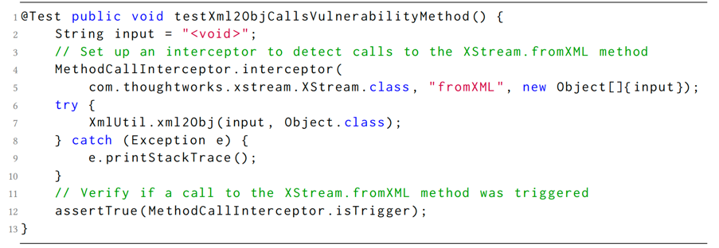

# VulnExV
> This tool aims to help you verify **the potential vulnerability exploitation risk** of third-party libraries used in your project
> 
**Paper: Automated Vulnerability Exploitation Verification for Third-party Library Dependencies in Client Software**

## Abstract
> In modern software development, open-source third-party libraries are widely used. These libraries offer
substantial advantages in terms of time and resource savings. However, a significant concern arises due to
the continuous appearance of publicly disclosed vulnerabilities within these libraries. Existing automated
vulnerability detection tools often suffer from false positives and fail to accurately assess the propagation of
inputs capable of triggering vulnerabilities from client projects to vulnerable code.
In this paper, we propose a novel approach called VulnExV (Vulnerability Explorer and Exploit Verifier),
which combines fine-grained source code analysis and unit test generation. VulnExV contributes to
the verification of vulnerability exploitability in third-party libraries that are essential for client software projects.
VulnExV first analyzes the source code of client projects to determine the reachability of vulnerability condi-
tions within them. Subsequently, it leverages the Large Language Model (LLM) to autonomously generate unit
tests for vulnerability verification. This approach comprises two phases: Vulnerability Accessibility Analysis,
which constructs a Parameter Transfer Graph (PTG) to identify the origins of vulnerability conditions and
evaluate their reachability, and Vulnerability Triggering Verification, which harnesses LLM’s test generation
capability to create unit tests for vulnerability validation. To evaluate VulnExV’s performance, we collect
vulnerabilities from various third-party libraries and conduct experiments on 36 real client projects. Besides, we
also compare our approach with the representative tool TRANSFER. Our results demonstrate the effectiveness
of VulnExV, with 166 out of 204 generated unit tests successfully confirming vulnerability exploitation across
29 client projects, exceeding the baseline by more than 4.1 times

## Method
> The implementation process of this method can be summarized as follows: first, perform code analysis on your project, and then attempt to generate unit tests that can exploit vulnerabilities in third-party libraries. If the test code is successfully generated, it indicates that you should be cautious, as your project may now be exposed to vulnerability exploitation risks. It is recommended to manually verify and address vulnerabilities in third-party libraries, such as upgrading library dependencies.

  

A generated test may look like this:  

## Usage
### Step 1: Task Parameter Configuration
Supplement parameter configurations in the task.properties file, including target project file paths, POC code information, and more.

### Step 2: Generate Prompts
Execute the Main class; this process will generate method call chains, perform parameter passing analysis, and construct prompts.

### Step 3: Generate Unit Tests
Invoke the GPT interface, which will produce complete test files.

### Step 4: Run Tests
Place the generated test files and the `MethodCallInterceptor` into the target project's test directory, and then execute the unit tests, which will produce output results.

## Files
src: source code
dataset: project-list, result